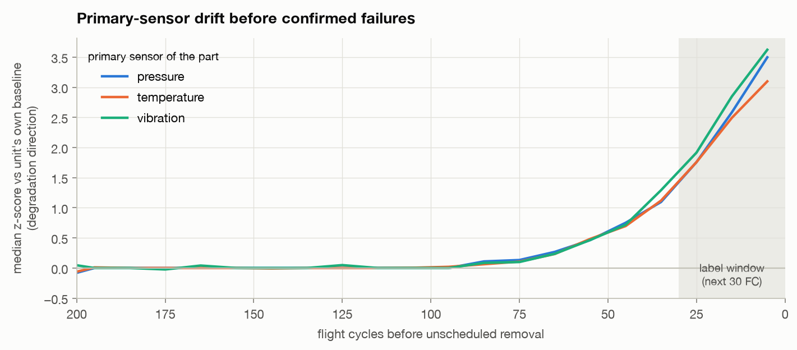
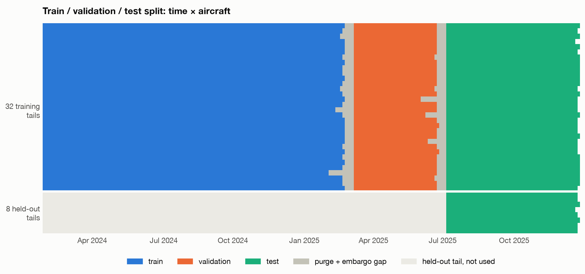
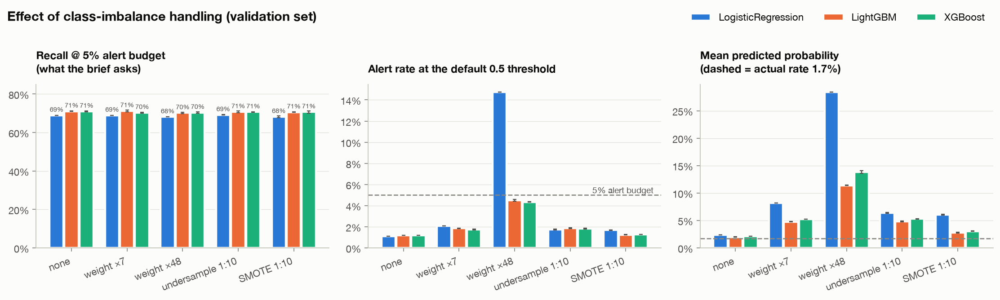
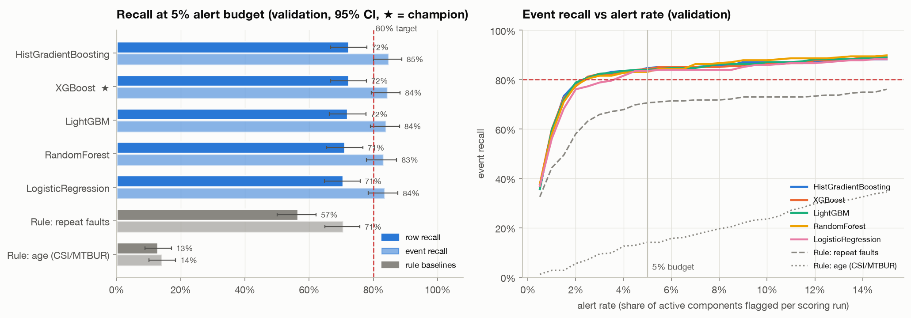
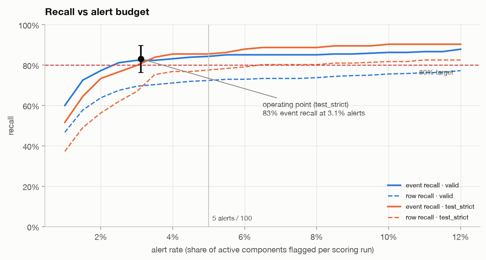
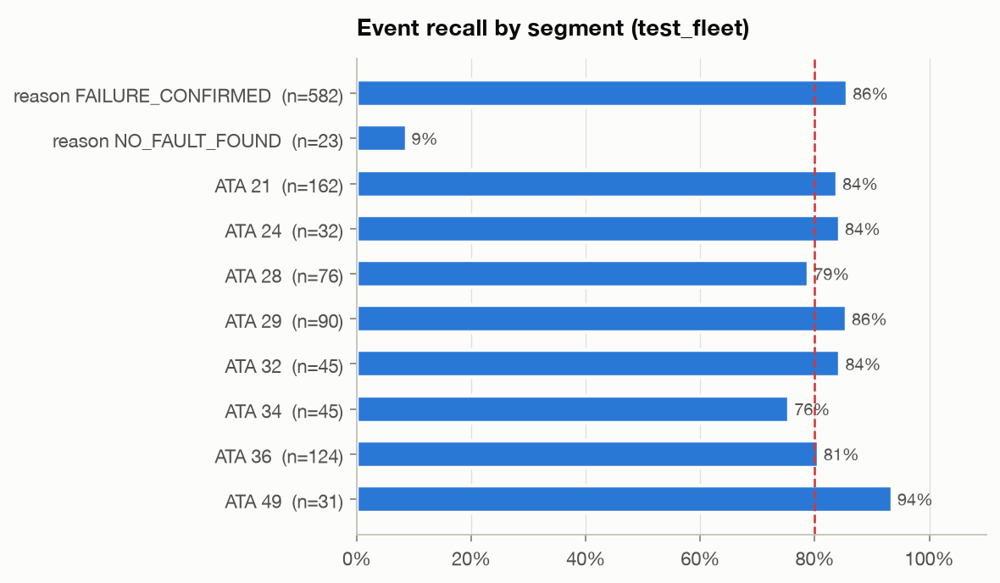
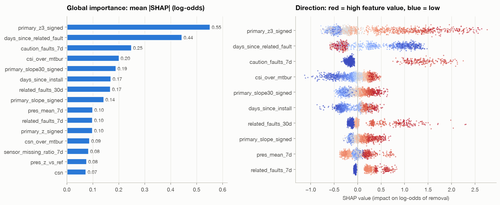
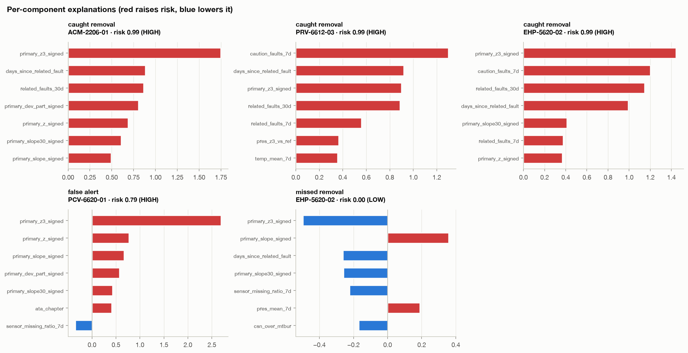
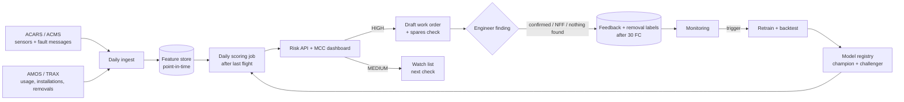

# Predicting Unscheduled Component Removals within 30 Flight Cycles

*Proof of concept for an aircraft MRO organisation · mock data · September 2026*

## Summary

The model scores every installed component each day with a risk of **unscheduled removal within the next 30
flight cycles (FC)**. On held-out test data it meets both targets in the brief:

| Target | test_strict (unseen aircraft and units) | test_fleet (whole fleet) |
|---|---|---|
| Detect ≥ 80% of actual removals | **83.1%** of removals (95% CI 76.2–89.7%) | **82.8%** (79.8–85.9%) |
| ≤ 5 alerts per 100 active components | max **4.7** per 100 in any run (mean 3.1) | max **4.6** (mean 3.1) |

About 45% of alerts are real removals, and 75% of HIGH-tier alerts are. The median warning comes **21 FC (~4 days)**
before removal. Every alert comes with its top three reasons in maintenance language.

The champion is a single **XGBoost** model with isotonic calibration. It beats two rule baselines that mirror
current practice by a wide margin (repeat-fault rule 71% and age rule 14% event recall at the same alert budget).
Four other models and several voting ensembles were no better.

All data is simulated (see [Limitations](#6-limitations-and-future-improvements)). The numbers show that the method
works end to end. They are not a forecast of performance on real fleet data.

---

## 1. Problem framing

- **Unit of prediction:** one installed serial number on one scoring day.
- **Label:** 1 if that installation ends in an **unscheduled** removal (confirmed failure or No-Fault-Found) within
  the next 30 FC of its aircraft. Scheduled removals (wear limit, opportunistic during a check) are planned work, so
  they count as 0. NFF counts as 1 because it still costs an unplanned removal.
- **Alert budget:** at most 5% of the components active on a scoring day can be flagged. This matches the hangar's
  inspection capacity and does not depend on how often the model runs.
- **What this means for the model:** with ~2% positives, the top 5% of scores must contain 80% of removals, a ~16x
  lift over random selection. The implied precision floor is 0.8 × 2 / 5 = 32%. The metric that matters is recall
  at a 5% alert budget. Accuracy and ROC-AUC do not measure it.

## 2. Data preparation and modelling approach

### 2.1 Mock dataset

A day-by-day fleet simulator ([`src/generate_data.py`](../src/generate_data.py)) produces 9 tables for 2024–2025:

- 40 aircraft (A320neo, A321neo, B737-800) at 6 bases in 3 climate zones
- 13 part numbers across 8 ATA chapters, 1,160 installed positions
- 730k daily sensor readings, 20k fault messages, 10k maintenance events
- 3,015 removals, 2,767 of them unscheduled

Mechanisms built in:
- Weibull wear-out per part number, plus climate and aircraft-age effects
- latent rogue units
- sensor drift and rising fault rates before most failures
- sudden failures and NFF removals with no clear precursor
- rotable units moving between tails through the shop

Sensor and fault data are keyed by **tail + position**, as ACMS data is, not by serial number. The data is
deliberately dirty:
- 7.7% missing sensor values, from three mechanisms
- sentinel glitch codes (0, −999, 9999) and spikes
- nuisance fault codes

Positive rate: **1.97%**.

### 2.2 Exploratory findings that shaped the pipeline

([`notebooks/01_eda.ipynb`](../notebooks/01_eda.ipynb))

- **Precursor signal:** the health sensor starts drifting ~90 FC before removal, passes 1σ ~35 FC before it, and
  reaches 2–3.5σ inside the label window. Related fault codes reach 19x the fleet average in the final week.
  → Features measure recent change against the unit's own baseline.
- **Age is a weak predictor:** 47% of unscheduled removals happen before 50% of MTBUR. → An age rule is the
  baseline to beat.
- **Outliers:** degradation itself produces extreme values. → Only physically impossible values and single-point
  spikes are removed.

### 2.3 Snapshot table and label

([`src/build_dataset.py`](../src/build_dataset.py))

- Snapshots every 3 days. **Weekly snapshots would miss 19.5% of removals entirely**, because 30 FC is only about
  6 days. Even a perfect model would then be capped near 80%. In production the model should score **daily**.
- Right censoring: snapshots with less than 30 FC of follow-up are dropped, positives and negatives alike.
- Result: 269,642 rows, 5,305 positives.

### 2.4 Features

([`src/features.py`](../src/features.py)): 48 numeric + 5 categorical features, all point-in-time.

| Group | Examples |
|---|---|
| Sensor | 3-day and 7-day mean vs the unit's own days −60…−15 (σ), 14- and 30-day slope, acceleration, deviation from the part-number baseline; the part's health sensor signed in its degradation direction (pressure drops, temperature/vibration rise) |
| Fault codes | related faults over 3 / 7 / 30 days, week-over-week trend, CAUTION+ count, days since the last related fault, nuisance count |
| Usage / age | CSI, CSN, CSO, CSI / MTBUR, utilisation |
| Maintenance history | troubleshooting and MEL deferrals during this installation; prior unscheduled / NFF removals of the serial on any tail; shop visits |
| Context | part number, ATA chapter, aircraft type, climate zone, aircraft age, outside air temperature |

ACMS records are attributed to the serial installed on that day, so a new unit never inherits the drift of the unit
it replaced.

**Leakage test:** [`tests/test_point_in_time.py`](../tests/test_point_in_time.py) rebuilds every feature from raw data
truncated at day *t* and checks it equals the full-history value. It caught one real leak during development:
utilisation averaged over two years was used to back-fill CSI for legacy installations. That was fixed.

A second feature iteration (3-day window, 30-day slope, acceleration) improved grouped-CV recall by +1.2 pt and
PR-AUC by +0.015, and was kept.

### 2.5 Data split: temporal, aircraft and component leakage

([`src/split.py`](../src/split.py))

| Layer | What we did |
|---|---|
| Temporal | Train Jan 2024–Feb 2025, validation Mar–Jun 2025, test Jul–Dec 2025. Rows whose 30 FC window crosses a boundary are purged (measured in cycles, so aircraft in a heavy check get a longer gap), plus a 7-day embargo |
| Aircraft | 8 tails held out (stratified by aircraft type **and** climate), never used in train/validation |
| Component | Train/validation history of every serial tested on a held-out tail is removed, so the model never saw a tested unit |

Filtering the **test** side for unseen serials left only 39 positives, biased towards brand-new units. Filtering the
**training** side instead kept 263 positives with the same guarantee.

Hyper-parameters are tuned with GroupKFold by tail inside the training period. Assertions check the split on every
build.

### 2.6 Data preparation

([`src/preprocess.py`](../src/preprocess.py)). Everything is fitted on the training split and embedded in the model
pipeline.

| Issue | Linear model | Tree models |
|---|---|---|
| Missing data (17 features, max 13%) | median by part number + missing flags | native NaN handling |
| Outliers | winsorise p0.1/p99.9, log1p counts (after sentinel/spike removal) | sentinel/spike removal only |
| Categorical | one-hot, unseen → zeros | ordinal, unseen → NaN |
| Class imbalance | no resampling; positive weight tuned in {1, ≈7} | same |

**Class-imbalance ablation** ([`src/imbalance_experiment.py`](../src/imbalance_experiment.py)): 3 models × 5
strategies (none, weight ×7, weight ×48, undersampling 1:10, SMOTE 1:10), evaluated on validation.

- Recall at the 5% budget moved by **±1 pt at most**, about the same as seed noise.
- Full weighting inflated the mean predicted probability from 2% to up to 28% (actual 1.7%). At a default 0.5
  threshold it pushed the alert rate to 14.7%, three times the budget.
- The threshold rule matters far more than the resampling rule. SMOTE also invents sensor histories that never
  happened, so it was not used.

### 2.7 Models and comparison

([`src/train.py`](../src/train.py))

Setup:
- 2 rule baselines and 5 ML models
- Random search with 4-fold GroupKFold by tail, optimising recall at the 5% budget
- Validation comparison with 95% cluster-bootstrap intervals, resampling whole serial numbers

Bootstrap is used for confidence intervals only. Using it to split the data would put near-duplicate snapshots of
one unit on both sides.

| Model | CV recall | Valid recall | Valid event recall | PR-AUC |
|---|---|---|---|---|
| **XGBoost ★** | 71.2% | 72.4% | 84.3% | 0.627 |
| HistGradientBoosting | 70.8% | 72.4% | 84.7% | 0.620 |
| LightGBM | 71.0% | 72.0% | 83.9% | 0.626 |
| Random Forest | 70.2% | 71.1% | 83.1% | 0.608 |
| Logistic Regression | 69.5% | 70.5% | 83.5% | 0.600 |
| Rule: repeat faults | – | 56.5% | 70.6% | 0.401 |
| Rule: age (CSI/MTBUR) | – | 12.8% | 14.1% | 0.033 |

- HistGB, XGBoost and LightGBM are statistically tied. The champion rule, fixed in code, picks the best grouped-CV
  recall among tied models: **XGBoost**.
- **Voting:** hard majority, soft and rank voting were tested with a pre-registered rule (adopt only if better in
  ≥ 90% of paired resamples). The best, rank voting of the top 3, gained +0.8 pt with P = 0.88, so it was not
  adopted. Boosting models' scores correlate at 0.91–0.93, so they miss the same removals.

## 3. Evaluation and threshold selection

([`src/evaluate.py`](../src/evaluate.py))

**Threshold selection on validation** uses an illustrative MRO value model:
- **$30,000** saved per anticipated removal (avoided AOG, delay, expedited spare)
- **$600** per inspection episode (consecutive alerts on one unit count as one inspection)
- The 5% per-run cap always applies

Value peaks at a mean alert rate of 3.7%. Beyond that, extra alerts add inspections but few extra catches. **The 5%
capacity is not binding.**

Tiers:
- **HIGH** (top ~1.5% per run): inspect within 5 FC and pre-position a spare.
- **MEDIUM** (rest of the alerts): inspect at the next check.

Risk is shown as a calibrated probability (isotonic on validation). Alerts are decided on the raw score, because the
isotonic output is a step function with many ties.

**Test results (evaluated once):**

| | test_strict | test_fleet |
|---|---|---|
| Removal events | 124 | 605 |
| Event recall | **83.1%** (76.2–89.7%) | **82.8%** (79.8–85.9%) |
| Row recall | 73.8% | 73.4% |
| Precision / HIGH-tier precision | 47% / 74% | 44% / 76% |
| Mean / max alert rate per run | 3.1% / 4.7% | 3.1% / 4.6% |
| Median lead time | 22 FC | 21 FC |
| PR-AUC / ROC-AUC | 0.685 / 0.932 | 0.674 / 0.922 |

- Performance on unseen aircraft and units matches the known fleet, so there is no sign of memorisation.
- test_strict has only 124 removals, and its CI lower bound is below 80%. The point estimate meets the target. A
  shadow period is needed before committing to it.
- Lead time: 95% of detected removals get their first alert at least 7 FC before removal.
- **Where the model fails:**
  - NFF removals are caught 9% of the time: there is no physical degradation to detect. Confirmed failures are
    caught 86% of the time.
  - Weakest systems: ATA 34 air data (76%) and ATA 28 fuel pumps (79%).
  - Temperate bases (78%) do worse than hot/sandy bases (86%).

## 4. Example predictions and explanations

([`src/explain.py`](../src/explain.py))

SHAP on the XGBoost model. The top drivers fleet-wide are the health-sensor 3-day deviation, days since the last
related fault, CAUTION/WARNING faults in 7 days, CSI/MTBUR and the 30-day slope. Their directions match engineering
expectations.

Each alert carries its top three SHAP contributions, written as sentences:

| Case | Component | Risk | Reasons | Outcome |
|---|---|---|---|---|
| Caught | Air cycle machine, ATA 21 | 0.99 HIGH | Vibration 5.2σ above own baseline (3 days) · last related fault today · 4 related ATA 21 faults in 30 days | removed 4 FC later |
| Caught | Bleed PRV, ATA 36 | 0.99 HIGH | 3 CAUTION/WARNING faults in 7 days · last related fault today · pressure 1.9σ below own baseline | removed 11 FC later |
| Caught | Electric hydraulic pump, ATA 29 | 0.99 HIGH | Temperature 3.3σ above own baseline · 3 CAUTION/WARNING faults · 5 related faults in 30 days | removed 1 FC later |
| False alert | Precooler valve, ATA 36 | 0.79 HIGH | Temperature 13σ above own baseline, but 43% of sensor data missing and no fault message in a year | no removal: likely a **sensor** fault |
| Missed | Electric hydraulic pump, ATA 29 | 0.004 LOW | Sensor stable (0.3σ) two cycles before removal, no related fault for 142 days | sudden failure with no precursor |

The false alert led to a production rule: an extreme sensor-only alert with poor data quality goes to a sensor check
first. Full cards: [`reports/results/example_explanations.json`](results/example_explanations.json). API responses:
[`docs/sample_responses/`](../docs/sample_responses/).

## 5. Proposed deployment and monitoring

**Deployment**
- Daily batch job after the day's ACMS/ACARS ingest, using the same code as [`src/predict.py`](../src/predict.py)
  and an API ([`api/main.py`](../api/main.py)).
- The live-vs-offline check matched 1,160/1,160 units with identical alerts.
- Model, calibration, thresholds and feature list ship as one versioned artifact (`risk_scorer.joblib`).

**Integration with MRO workflows**
- **HIGH:** a draft work order or task card in AMOS/TRAX carrying the three reasons, plus an automatic check of
  serviceable spare stock at the next station.
- **MEDIUM:** goes to the watch list for the next daily or weekly check.
- **Engineer feedback:** the finding (confirmed defect / NFF / nothing found) is captured on the task card. That
  gives alert-quality metrics now and labels later.
- **Reliability engineering:** a monthly review of false alerts and misses by ATA chapter.

**Monitoring**

| What | How | Trigger |
|---|---|---|
| Data quality | missing-sensor ratio and outages per tail, sentinel rate, late feeds | data alert to avionics / IT, component scored with `confidence: reduced` |
| Input drift | PSI of the top-15 SHAP features, weekly, vs the training window | PSI > 0.25 on any top-5 feature |
| Prediction drift | alert rate per run, score distribution, share of HIGH | alert rate outside 2–5% for 2 weeks |
| Performance (labels arrive 30 FC later) | rolling 8-week event recall, precision, lead time, by ATA and base | event recall < 80% or precision < 32% |
| Business | inspections per catch, NFF share of alerts, avoided AOG | quarterly review |

**Retraining:** quarterly on a rolling 18-month window, or earlier on a trigger, a new aircraft type or part
number, or a change to the maintenance programme. A new model runs in **shadow mode for 4–8 weeks** as challenger
and is promoted only if it beats the champion on event recall at the same alert budget. The previous version stays
in the registry for rollback.

**New components, missing data, drift**
- **New serial (young installation):** scored from day one. Without its own baseline, the model falls back on
  part-number baselines, fault codes and serial history. It is flagged `low_history` with reduced confidence
  (tested).
- **New part number or aircraft type:** preprocessing maps unseen categories to "unknown" (tested). Alerts are
  shown as advisory until enough history exists, and the part is added at the next retrain.
- **Missing data:** tree models handle NaN natively, and missing-data features tell the model that data was absent.
  Long outages raise a data-quality alert instead of silently scoring on stale data.
- **Drift:** handled by the monitoring and retraining loop above. Because labels arrive 30 FC late, input and
  prediction drift act as the early warnings.

## 6. Limitations and future improvements

**Limitations**
1. **Mock data.** The precursor mechanism was designed by the author, so real precursors will be weaker, noisier
   and vary more by part number. Expect lower recall on real data. The method, split and evaluation carry over;
   the numbers do not.
2. **Small held-out set.** test_strict holds 124 removals, and its 95% CI reaches down to 76%.
3. **NFF and sudden failures are largely undetectable.** Recall plateaus at ~85–88% even with 15% alerts.
4. **Label quality.** Real removal reasons and NFF coding are noisy, which caps achievable precision.
5. **Short horizon.** A median 21 FC warning is enough to pre-position a spare but not to plan a hangar slot.
6. **Feedback loop.** Once alerts trigger preventive removals, the failures they prevent disappear from future
   labels. Retraining must record model-triggered removals separately.
7. **Illustrative value model.** The $30k / $600 figures are assumptions to be replaced with the operator's own
   costs.

**Future improvements**
- A time-to-event (survival) model giving risk over several horizons (10 / 30 / 100 FC) for planning and spares.
- A sensor-health model to separate sensor faults from component faults (the false-alert case).
- Per-ATA thresholds and per-part cost weights in the value model.
- Text features from pilot reports and tech-log entries.
- Sequence models on raw sensor streams once real data volume allows.
- Conformal prediction for calibrated uncertainty on each score.
- Active learning from engineer findings.

---

*Reproduce:* `pip install -r requirements.txt`, then run the steps in [README](../README.md) (about 20 minutes
end to end). Tests: `python -m pytest tests/` (12 tests: point-in-time features, preprocessing guarantees, API
contract).
